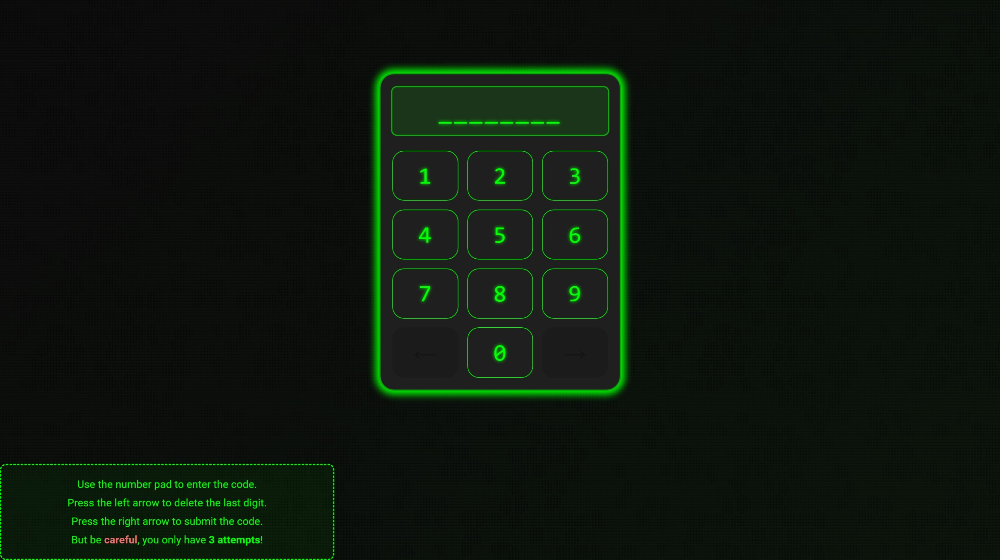
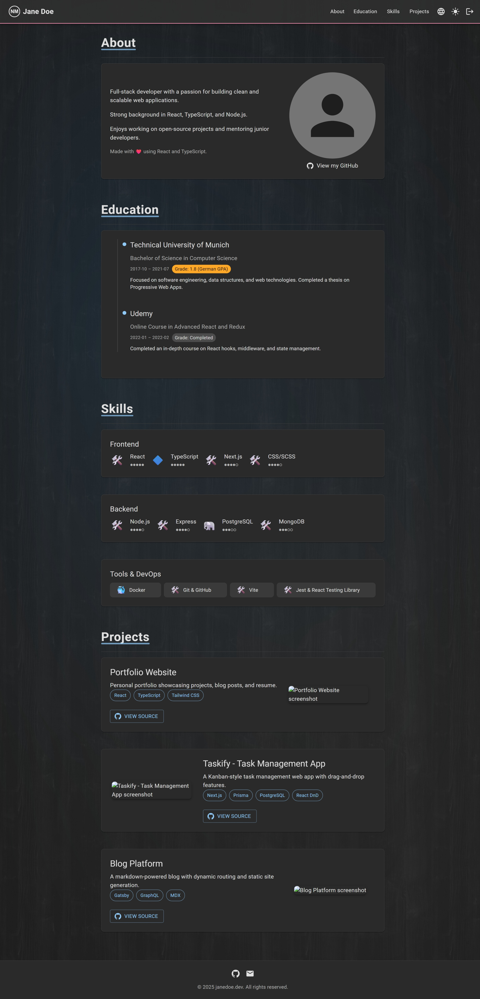

# website-frontend

This application serves as the frontend for a personal website and is supposed to be deployed and served by
the corresponding backend server that can be found at: https://www.github.com/nimazzo/website-backend. This app is built
using React, Vite and Material UI and consists of a lockscreen as well as a personal homepage. The lockscreen is used to
authenticate users, while the homepage displays the content of the website. For more detailed information check out the
documentation in the [website-backend](https://www.github.com/nimazzo/website-backend) repository.

## Table of Contents

- [Requirements](#requirements)
- [Setup](#setup)
- [Screenshots](#screenshots)

## Requirements

In order to run the application, you need to have the following installed (tested with):

- Node.js v22.14.0
- npm 10.9.2

## Setup

To build and run this application, follow these steps:

### Clone the repository

```sh
$ git clone https://github.com/nimazzo/website-frontend.git
$ cd website-frontend
$ npm install
```

### Run the Dev Server

To run the website frontend in development mode, without a backend server, execute the following command:

```sh
$ npm run dev
```

This will start a development server on `http://localhost:5173` where you can access the lockscreen at
`http://localhost:5173` and the homepage at `http://localhost:5173/home`.

### Build and Export

Bulding and exporting the application for production is a two-step process. First you need to copy the
`lockscreen/index.html` file to the root directory of the project and name it `index2.html`.
You can then run the build command

```sh
$ npm run build
```

to export the static lockscreen files to the `dist` directory. After that you can copy the resulting files to the
`src/main/resources/static/public` directory of the backend server project. Remove the `dist` directory afterwards.

Now, repeat the process for the homepage. Copy the `homepage/index.html` file to the root directory of the project and
name it `index2.html`. Then run the build command again and copy the resulting files to the
`src/main/resources/static/private` directory of the backend server project.

> **Important:** Make sure to rename the `index2.html` files to `index.html` after copying them to the respective
> directories in the backend server project.

## Screenshots

### Lockscreen



### Homepage


